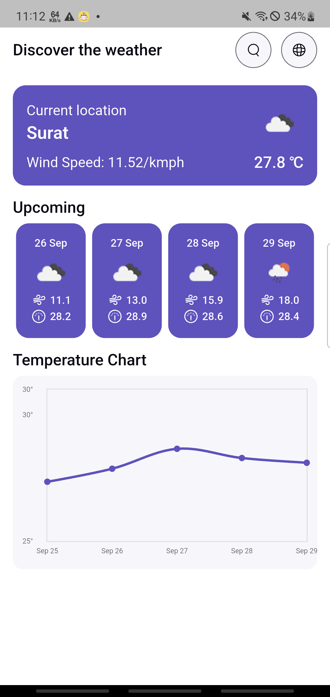
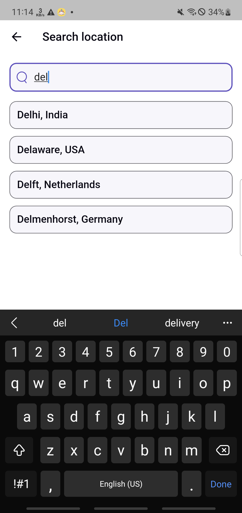

# Weather App

A clean, scalable Flutter weather application featuring current weather data, location permission handling, weather maps, and location search functionalities. The app uses Bloc for state management, clean architecture principles, and dependency injection for modularity.

## Features

- **Current Location Weather**: Automatically fetch weather data for user's current GPS location.
- **Location Permission Handling**: Robust permission flow with user-friendly prompts.
- **Search Locations**: Search for cities to view weather forecasts.
- **Weather Map**: Interactive weather map with toggles and detailed weather markers.
- **Clean Architecture**: Separation of concerns with data, domain, and presentation layers.
- **Bloc State Management**: Easy-to-manage state with cubits and blocs.
- **Dependency Injection**: Using `get_it` for scalable and testable code.
- **Localization Support**: Supports multiple locales.


## App Video & Apk 

▶[App Video & Apk Link](https://drive.google.com/file/d/1Dpnz_AWeXLWOqNdbjzENhTrjb2i_flZD/view?usp=drive_link)

## Screenshots

## Permission Check Screen


## Home Screen With Chart


## Search Location Screen




## Show Weather Layer


## Setup
Flutter SDK: 3.32.4

## Command for generate strings
```flutter gen-l10n```


